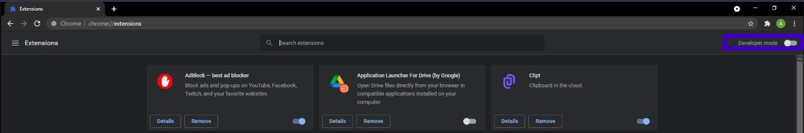

# Custom Scrollbar
An open source extension for Chromium-based browsers that replaces the traditional default scrollbar with a more modern looking one.

## Appearance

 

## Installation

1. Grab a copy of the latest version [here](https://github.com/afk-echo/CustomScrollBar-ChromiumExt/releases)!
2. Extract the .zip file into a folder of your choice on your system.
3. Open `<browser-name>://extensions` on your browser of choice. (eg. `chrome://extensions` or `brave://extensions`)
4. Enable **Developer Mode** in the page that pops up.
5. Click `Load unpacked` and select the folder where you extracted the previously downloaded .zip file.

The extension should now be loaded and enabled. Check out the new scrollbar by opening a new webpage, and have fun!
